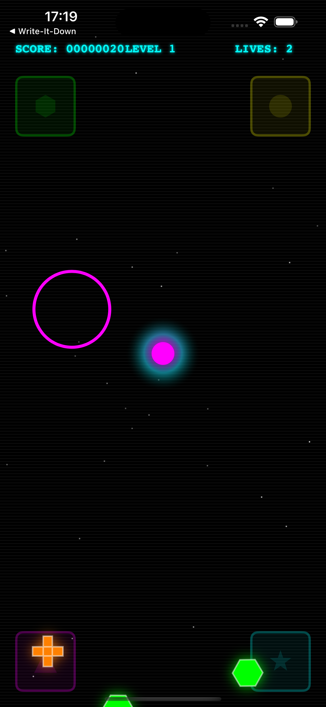
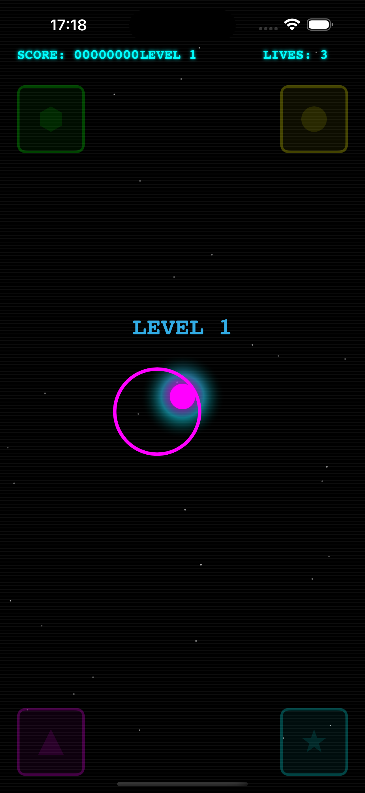

# Gravity Well 🕹️

<table>
<tr>
<td></td>
<td></td>
</tr>
</table>

An arcade-themed physics puzzle game for iOS featuring motion controls and retro aesthetics.

## Features
- **Motion Controls**: Tilt device to control gravity direction
- **Shape Matching**: Guide colored shapes to matching collection zones
- **Retro Aesthetics**: Neon colors, scanlines, and arcade-style UI
- **Progressive Difficulty**: Speed increases with each level
- **Physics-Based**: Realistic gravity and collision detection

## Gameplay
Protect the central portal by collecting shapes in their matching zones. Lose lives when shapes hit the portal. Score points and advance levels by successful
collections.

## Requirements
- iOS 18.5+
- Device with motion sensors (gyroscope/accelerometer)

## Architecture
Clean MVVM architecture with separated concerns:
- `GameState`: Score, lives, level management
- `PhysicsManager`: UIDynamics and motion handling
- `VisualEffects`: Particles, explosions, scanlines
- `GameHUD`: UI elements and messaging

Built with UIKit, Core Motion, and UIDynamics.
